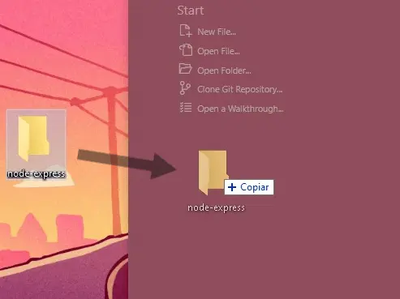
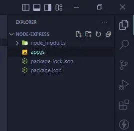
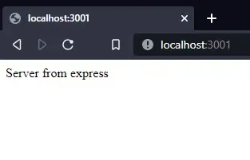

# ¿Qué es Express?

Express es una librería para la creación de aplicaciones web y crear servicios REST Api en conjunto de Node.

Es una de las librerías más populares en Node.js y se utiliza para crear servidores web y manejar solicitudes HTTP. 
Con Express, puedes crear rutas para manejar diferentes solicitudes HTTP, manejar middleware, generar respuestas HTTP y mucho más.

En esta ocasión vamos a crear un servidor básico con node en conjunto de Express y su manejador de rutas.

## Requisitos

- Node (recomendable la versión **TLS** más reciente)
- NPM
- Express
- Un editor de código; recomendación [VSCode](https://code.visualstudio.com/)

## Instalación

### Node
Si no tienes Node, [puedes ir a la web](https://nodejs.org/es/) y dependiendo de tu sistema operativo descargar el instalador de Node.

Una vez descargado e instalado puedes verificar su instalación abriendo una ventana de comandos y escribiendo lo siguiente:
```cmd title="Command Line"
node -v

-> Output: V16.15.1
```
Si recibes una respuesta como **v16.15.1** significa que esta todo listo, de lo contrario habrá que verificar la instalación.

### NPM
Por defecto, NPM es instalado y lo puedes comprobar escribiendo en una ventana de comandos lo siguiente:
```cmd title="Command Line"
npm -v

-> Output: 9.2.0
```
Si recibes una respuesta como **9.2.0** significa que esta todo listo, de lo contrario habrá que verificar la instalación de Node, ya que es el encargado de esta herramienta.

### VSCode
VSCode es un editor de código fuente que sirve como herramienta de desarrollo completa que incluye varias características como depuración, integración de líneas de comandos,
control de versiones ademas de una sección de extensiones que permite ampliar su funcionalidad dependiendo del enfoque que sea requerido; como desarrollo web, 
desarrollo de sistemas, desarrollo backend y dependiendo del lenguaje a usar añadiremos las extensiones necesarias.

Lo primero es que descarguemos el [instalador](https://code.visualstudio.com/) de la web dependiendo de tu sistema operativo.

### Express
Existen varias formas de ejecutar Express dentro de un proyecto, pero en esta ocasión crearemos un proyecto básico de Node donde instalaremos de forma local Express y 
procederemos a ejecutarlo.

## Creación del proyecto
1. Abrir VSCode.
2. Crear una carpeta nueva
3. Abrir carpeta con VSCode

Para empezar, abriremos una ventana de VSCode para empezar a trabajar.
Una vez abierto, crearemos una carpeta en la ubicación de nuestra elección, si no hay ninguna en concreto puede ser en el escritorio y después moverlo a otro lugar en particular.
Arrastramos la carpeta dentro de la ventana de VSCode para empezar a trabajar.




## Inicialización del proyecto de node

empezaremos abriendo una terminal en el menu `Terminal -> New Terminal` pulsando <kbd>ctrl + shift + ñ</kbd> si se tiene en español el idioma actual.

En la terminal escribimos el siguiente comando:
```cmd title="Command Line"
npm init -y
```

> _La bandera `-y` le indicará a npm que cree un proyecto de node con la configuración por defecto._

Esto creará un archivo `package.json` el cual contendrá toda la configuración del proyecto.

## Instalación y uso de Express
Lo siguiente es instalar el paquete de Express con el siguiente comando:

```cmd title="Command Line"
npm i express
```

Una vez terminada la instalación creamos un nuevo archivo llamado `app.js`


:::info
El archivo package-lock.json y la carpeta node-modules se crean por defecto al instalar un paquete y por lo general no se tocan para nada.
:::

Dentro del archivo importamos Express:
```js title="./app.js"
const Express = require('express')
```

Declaramos una instancia de Express y el puerto donde estará el servidor:
```js title="./app.js"
const app = Express();
const port = 3001
```

Para añadir rutas en las cuales utilicemos Express, usamos su función get, el cual es uno de los verbos HTTP y el más básico.
```js title="./app.js"
app.get('/', (req, res)=> {
  res.send('Server from express')
})
```
> _Podemos declarar la cantidad de  rutas que necesitemos..._

Por último, ejecutamos el servidor para dejarlo escuchando peticiones:
```js title="./app.js"
app.listen(port, () => {
  console.log('Server on port', port)
})
```
Esta última función requiere de dos parámetros, la primera es el puerto donde sera ejecutado el servidor, y el segundo es un callback opcional, 
en el podemos agregar algún bootstrap para otras aplicaciones o simplemente un `console.log('...')` como en este caso para que nos avise por consola
que el servidor ya ha arrancado.

**Código completo:**
```js title="./app.js"
const Express = require('express');

const app = Express();
const port = 3001;

app.get('/', (req, res)=> {
  res.send('Server from express')
})

app.listen(port, () => {
  console.log('Server on port', port)
})
```

:::tip
No olvides guardar tu código con <kbd>ctrl + s</kbd>
:::

## Inicializar el servidor
Volveremos a la terminal y para ejecutar el archivo escribiremos el siguiente comando:
```cmd title="Command Line"
node app.js
-> Output: Server on port 3001
```

Vamos al navegador y en la dirección `http://localhost:3001/` tendremos el resultado de la ruta `/`.



## Módulos ECMAScript (ES)
Si lo que quieres es usar los módulos ES, hay que hacer algunos cambios, y aunque express también puede ser implementado usando la sintaxis de módulos ES que Javascript ofrece esto es tema de Node y para hacerlo hay que hacer 2 cambios principalmente:

1.- [Añadir la propiedad type dentro del `package.json`.](#1--añadir-la-propiedad-type-dentro-del-packagejson)

2.- [Cambiar la forma de llamar a Express dentro de `app.js`.](#2-cambiar-la-forma-de-llamar-a-express-dentro-de-appjs)


### 1.- Añadir la propiedad type dentro del `package.json`.
Para empezar, iremos al `package.json` y añadiremos lo siguiente:
```js
"type": "module",
```

:::note
Importante la coma al final dependiendo si le siguen mas propiedades, si es la última no es necesario.
:::

Esta línea la podemos añadir en cualquier parte del archivo junto a las llaves principales, es decir no hay que ponerlo dentro de otra llave:
```js {6} title="package.json: ✔ Forma correcta, dentro de las primeras llaves"
{
  "name": "express",
  "version": "1.0.0",
  "description": "",
  "main": "index.js",
  "type": "module",
  "scripts": {
    "test": "echo \"Error: no test specified\" && exit 1"
  },
  "keywords": [],
  "author": "",
  "license": "ISC",
  "dependencies": {
    "express": "^4.18.2"
  }
}
```

```js {14} title="package.json: ❌ Forma incorrecta, dentro de otro objeto"
{
  "name": "express",
  "version": "1.0.0",
  "description": "",
  "main": "index.js",
  "scripts": {
    "test": "echo \"Error: no test specified\" && exit 1",
  },
  "keywords": [],
  "author": "",
  "license": "ISC",
  "dependencies": {
    "express": "^4.18.2",
    "type": "module"
  }
}
```

### 2. Cambiar la forma de llamar a Express dentro de `app.js`.
Esta parte es más sencilla, simplemente cambiaremos la forma de require (forma de importar en commonjs) 
a import (forma de importar con los módulos ES): 

```js title="./app.js"
import Express from 'express';

const app = Express();
const port = 3001;

app.get('/', (req, res)=> {
  res.send('Server from express')
})

app.listen(port, () => {
  console.log('Server on port', port)
})
```

Si volvemos a ejecutar el servidor de nuevo, veremos que tendremos el mismo resultado pero ahora utilizando los módulos ES.